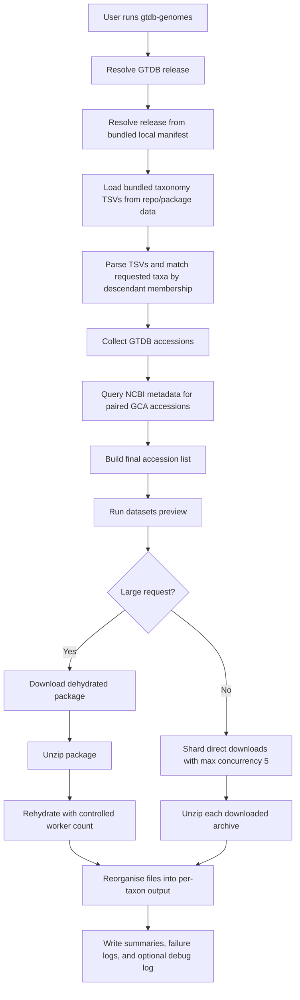

# Pipeline Concept

This document explains the intended end-to-end behaviour of `gtdb-genomes` before implementation starts.

## Purpose

`gtdb-genomes` is designed to translate GTDB taxon requests into genome downloads from NCBI. The key problem is that GTDB taxonomy tables identify genomes by assembly accession, while the actual data retrieval should be delegated to the NCBI `datasets` command-line tool.

The pipeline is designed around four priorities:

1. support historical and current GTDB releases
2. retrieve all matching genomes whenever possible
3. prefer `GCA` accessions when a paired GenBank accession exists
4. keep secrets out of logs and saved files

## High-Level Workflow

Dry-run note:

- `--dry-run` may resolve releases from the bundled local manifest, read bundled taxonomy TSVs, and query accession metadata, but it must not contact GTDB, download genome payloads, or create the final output tree.
- automatic retries apply only to `datasets download genome accession` and `datasets rehydrate`, using one initial attempt plus up to 3 retries.

## Step-By-Step Concept

### 1. GTDB release discovery

The tool must not assume that all GTDB releases use the same file naming scheme, but it also must not depend on GTDB network access at runtime.

The release resolver is expected to:

- accept friendly inputs such as `latest`, `214`, `226`, `220.0`, or `release220/220.0`
- resolve those into a concrete bundled release identifier using a local bundled manifest
- map the bundled release identifier to local taxonomy TSV file paths

The bundled manifest is expected to live under a path such as `data/gtdb_taxonomy/releases.tsv`.

`latest` must resolve from this local bundled manifest rather than from GTDB over the network.

Historical naming variants that must be supported include:

- `bac_taxonomy_r80.tsv`
- `bac120_taxonomy_r214.tsv`
- `bac120_taxonomy.tsv`
- `ar122_taxonomy_r95.tsv`
- `ar53_taxonomy_r214.tsv`
- `ar53_taxonomy.tsv`

This manifest-driven approach avoids hardcoding one modern filename pattern and removes GTDB runtime access as a failure mode.

### 2. Bundled taxonomy TSV access

The taxonomy TSVs are planned to be bundled with the software for every supported GTDB release.

Planned bundled-data behaviour:

- store files under `data/gtdb_taxonomy/<resolved_release>/`
- ship a local release manifest that maps accepted release inputs to bundled file paths
- read only the files needed for the chosen release at runtime
- keep the bundled data separate from user output directories
- treat missing bundled files as a local installation or packaging error

This design eliminates GTDB runtime access failures. Dry-run and normal execution both use the same bundled taxonomy data.

### 3. Taxon descendant matching

The user will provide one or more GTDB taxa with repeatable `--taxon`.

The planned matching rule is descendant membership:

- a genome matches when its GTDB lineage contains the requested token
- `g__Escherichia` selects all genomes under that GTDB genus
- `d__Bacteria` selects all bacterial genomes in the chosen release

This behaviour is more practical than exact-string matching because GTDB taxa are usually requested as lineage anchors rather than complete lineage strings.

### 4. Accession resolution and `GCA` preference

Each selected GTDB row provides an accession that becomes the starting point for download planning.

The accession resolution stage is designed to:

- retain the original GTDB accession as the source of truth for traceability
- ask NCBI for assembly metadata
- replace `GCF_*` with the paired `GCA_*` accession when a GenBank counterpart exists
- keep the original accession when no paired `GCA` accession is available

This gives the best possible coverage while still preferring `GCA` accessions where available.

### 5. Download-method choice

The tool will support three user-visible modes:

- `direct`
- `dehydrate`
- `auto`

In `auto` mode, the current planned policy is:

- run `datasets download genome accession --preview`
- if the request contains at least 1,000 genomes, use dehydrate/rehydrate
- if the previewed package exceeds 15 GB, use dehydrate/rehydrate
- otherwise use direct download

These thresholds are intended to keep smaller jobs simple while pushing very large jobs towards the workflow that NCBI recommends for large downloads.

The planned `--include` rule is intentionally strict:

- the value is passed through to `datasets`
- `genome` must be present in the requested include set
- values such as `none` are rejected because the tool is defined as a genome retriever

### 6. Direct download sharding

When direct download is chosen, the tool is expected to:

- split the accession list into approximately even batches
- launch multiple `datasets download genome accession` jobs in parallel
- never exceed `min(--threads, 5)` concurrent download jobs

The direct-download cap is intentional. It limits server pressure while still allowing practical throughput improvements on large, but not enormous, requests.

Only direct download operations are retried automatically. Metadata lookups and preview calls are not retried by design. GTDB taxonomy fetches do not exist in this model because taxonomy data is bundled locally.

### 7. Dehydrate and rehydrate flow

For larger requests, the tool should:

1. create one dehydrated package with `datasets`
2. unzip the package into a working directory
3. run `datasets rehydrate --directory <dir>`
4. control rehydrate worker count with `min(threads, 30)`
5. retry `datasets rehydrate` on failure up to 3 times after the initial attempt

This keeps large transfers aligned with the intended `datasets` workflow and avoids running many independent direct downloads for large jobs.

### 8. Unzip and output reorganisation

The raw `datasets` package layout is useful internally, but not ideal as the final user-facing layout.

Before writing output, the tool must check `--output` and fail fast if the directory already exists and is non-empty.

The planned output structure is:

- `OUTPUT/run_summary.tsv`
- `OUTPUT/accession_map.tsv`
- `OUTPUT/download_failures.tsv`
- `OUTPUT/taxon_summary.tsv`
- `OUTPUT/debug.log` when `--debug` is enabled
- `OUTPUT/taxa/<taxon_slug>/taxon_accessions.tsv`
- `OUTPUT/taxa/<taxon_slug>/<assembly_accession>/...`

Important rules:

- do not create a shared `OUTPUT/genomes/` directory
- duplicate genomes across taxa are copied into every matching taxon directory
- log every duplicate-copy action clearly
- keep summary files directly under `OUTPUT/`
- keep per-taxon manifest files directly under each taxon directory
- preserve the full downloaded accession payload in each final accession directory, including metadata and any extra file classes requested through `--include`

This layout optimises for human browsing by taxon rather than for deduplicated storage.

Taxon directories are derived from a filesystem-safe taxon slug:

- keep the GTDB token readable
- replace spaces and unsafe characters with underscores
- collapse repeated underscores
- append a short hash suffix only when two taxa would otherwise collide

If some genomes fail after all retries but others succeed, the tool keeps the successful output, writes failure summaries, and exits non-zero.

## Logging, Debug Mode, and Secret Redaction

The planned implementation should use structured, explicit logging with careful secret handling.

Normal logging should describe:

- release resolution
- bundled taxonomy manifest resolution and file selection
- number of matched genomes
- choice of direct vs dehydrate mode
- duplicate copy operations
- failures and skipped accessions

Failure TSVs must contain only redacted error messages.

`--debug` should additionally record:

- redacted command lines
- timings for major phases
- batch sizes
- bundled data selection decisions
- copy and reorganisation details

The API key must:

- never be written to logs
- never be written to manifests or bundled-data indexes
- never appear in the debug log

One residual risk remains: a literal key typed on the shell command line may still be exposed through shell history or operating-system process inspection outside the control of this tool.

## Why This Design

This pipeline separates the problem into small, predictable stages:

- GTDB is used for taxonomic selection
- NCBI metadata is used for accession refinement
- `datasets` is used for retrieval
- local reorganisation produces the final user-facing layout

That separation keeps the implementation modular, makes testing easier, and allows future extension without changing the overall model.

An additional operational benefit is that supported releases remain available on first run without GTDB network access.
